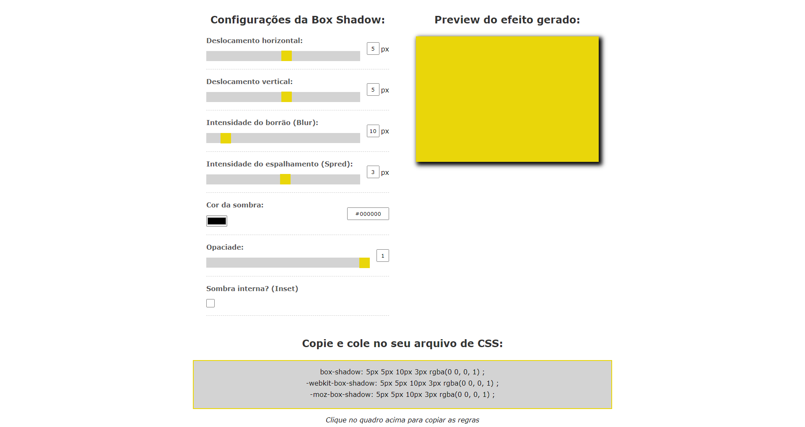

# Box Shadow
 
Hello!
Você que muitas das vezes não sabe  como decora as regras para poder fazer aquela sombra marota no seu site, fiz este box shadow para poder ajudar os Desenvolvedores a fazer de forma rápida e pratica.

Este projeto foi realizado utilizando HTML, CSS e JavaScript.

<a href="https://box-shadow-ten.vercel.app/">Box Shadow</a>

